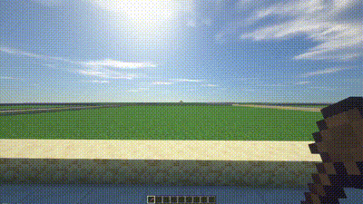

<h1 align="center">
  
</h1>

<p align="center">
  <a href="#-project">💻 Project</a>&nbsp;&nbsp;&nbsp;|&nbsp;&nbsp;&nbsp;
  <a href="#-requirements">✨ Requirements</a>&nbsp;&nbsp;&nbsp;|&nbsp;&nbsp;&nbsp;
  <a href="#-configuration">⚙️ Configuration</a>&nbsp;&nbsp;&nbsp;|&nbsp;&nbsp;&nbsp;
  <a href="#-how-to-use">🚀 How to use</a>&nbsp;&nbsp;&nbsp;
</p>

<p align="center">
   
</p>


<p align="center">
   
</p>


## 💻 Project

a PlotSquared-compatible plugin alongside with FastAsyncWorldEdit. Simplify land excavation for players without the need for manual effort. Elevate your server experience with automated excavation, offering convenience without the need for a revolution. Seamlessly integrate this plugin for a smoother gameplay journey.

## ✨ Requirements

- Minecraft 1.16+
- FastAsyncWorldEdit
- PlotSquared

## ⚙️ Configuration

This plugin does not require any previous configuration to run, but you still have the possibility to customize almost everything about it by editing the [config.yml](#-configuration) file.

```
messages:
  terra_purge_command: "&2&l[SERVER] &a/terrapurge <name> <amount>"
  terra_purge_item_gave: "&2&l[SERVER] &aYou gave {amount} excavation item to {player}"
  terra_purge_confirmed: "&2&l[SERVER] &aPlot excavation confirmed"
  terra_purge_cancelled: "&2&l[SERVER] &cPlot excavation cancelled"

require_confirmation: true
confirmation_inventory:
  title: "Escavar Terreno - Confirmar"
  size: 27
  items:
    confirm:
      slot: 11
      id: LIME_TERRACOTTA
      name: "&2&lCONFIRMAR"
      glow: false
      description:
        - ""
      sound: BLOCK_NOTE_BLOCK_BELL
    cancel:
      slot: 15
      id: RED_TERRACOTTA
      name: "&c&lCANCELAR"
      glow: false
      description:
        - ""
      sound: BLOCK_ANVIL_USE

item:
  id: STONE
  name: "&eLimpador de Terrenos"
  glow: true
  description:
    - ""
    - "&aClique com o botão direito"
    - "&ano seu terreno para limpar"
    - "&atodos os blocos"
    - ""
```

## 🚀 How to use

If you're completely beginner and don't even know how to start a minecraft server, I highly recommend you to follow the steps at [Spigot](https://www.spigotmc.org/wiki/buildtools/) before downloading this plugin.

These are the following steps to use the plugin:
1. Download [TerraPurge](https://github.com/joaocansi/terra-purge/releases)
2. Move `.jar` file to your `plugins` folder
3. Reload the server.

To give the item which purge the plot's ground use the following:
`terrapurge <player_name> <amount>`
The permission is `terrapurge.admin`